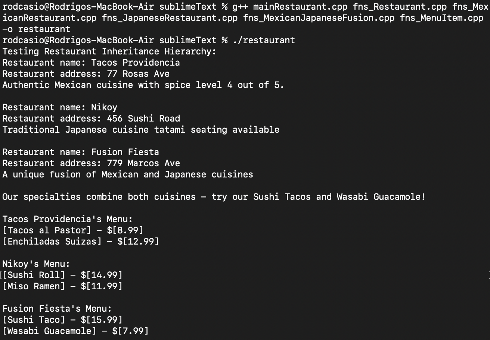

# Restaurant Inheritance Hierarchy (C++)

This is a small C++ project I made to practice object-oriented programming (OOP), especially inheritance. The program uses a restaurant theme to show how single, multiple, and virtual inheritance work in C++.

## What does it do?

- **Creates different types of restaurants** (Mexican, Japanese, and a fusion of both) using classes and inheritance.
- **Manages menus** for each restaurant using vectors.
- **Shows how polymorphism works** by letting each restaurant describe its own cuisine.
- **Demonstrates inheritance** by having some classes inherit from more than one parent (multiple inheritance) and using virtual inheritance to avoid problems.
- **Prints out information** about each restaurant and their menus.

## Example Output

When you run the program, you’ll see output like this (screenshot or text):



## Why did I make this?

I wanted to get more comfortable with C++ classes, inheritance, and how to use vectors. This project helped me understand how single and multiple inheritance work, and how to use virtual inheritance to solve the diamond problem.

## How to Run
This project uses **CMake** build system generator for easy, cross-platform compilation. Follow these steps from the root directory of the project `RestaurantInheritance/`

1. **Ensure CMake is installed:**
- Make sure you have CMake (version 3.1- or higher please) and a C++ compiler (g++ or clang++) installed on your system.

2. **Generate the build system (configure):**
- Create a separated directory for the build files  and run CMake inside it. Keeping source files clean

```bash
mkdir build
cd build
cmake ..
```

3. **Build:**
- Use generated build system (`make` on Unix-like systems) to compile the executable.

```bash 
make
```

4. **Run the program:**
- The executable (RestaurantInheritance) will be placed inside the `build` directory.

```bash 
./RestaurantInheritance
```

**IMPORTANT: Note for windows users:**

- Windows developers have two ways to build the project using CMake.
  - **Command line (MSYS2/Cygwin):** If you use an environment like **MSYS2** or **WLS** (Windows Subsystem for Linux), you can follow the **Standard Build** steps above exactly.
  - **Visual Studio:** CMake can generate a Visual Studio solution. Run CMake from your `developer command prompt`, specify the generator:

```bash 
cmake .. -G "Visual Studio 17 2022"
```

Then, open the generated `.sln` file and build within Visual Studio IDE.

## Author

Rodrigo Casio  
[My GitHub Profile](https://github.com/rodrigcasio)

